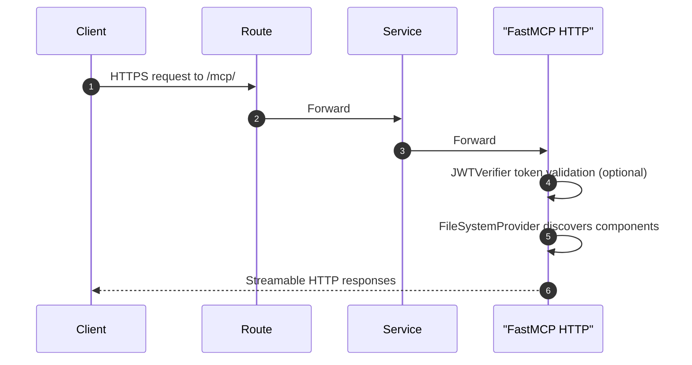
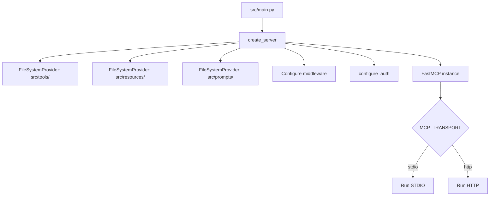
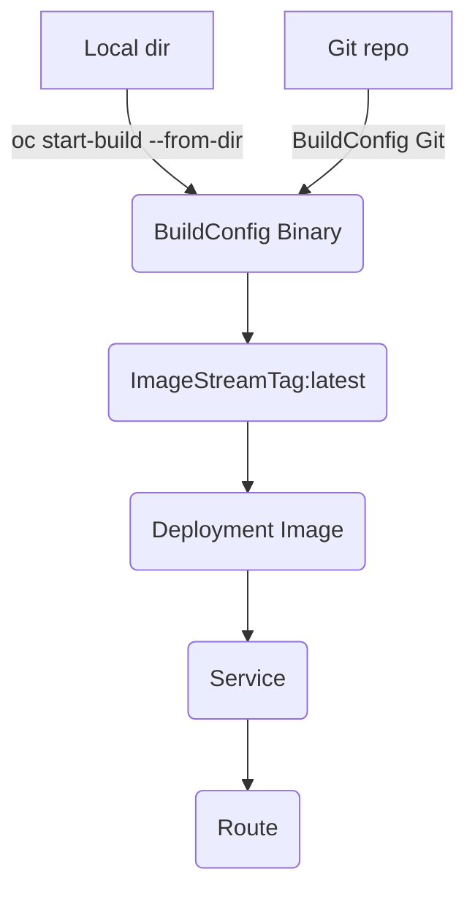
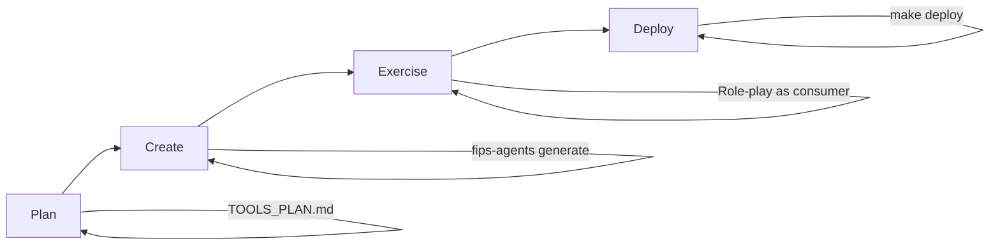

# Architecture

This project implements a [FastMCP 3.x](https://gofastmcp.com) server with local STDIO and OpenShift HTTP transports, filesystem-based component discovery, and OpenShift-native build/deploy.

- Core framework: FastMCP 3.x with standalone decorators
- Component discovery: `FileSystemProvider` scans `src/tools/`, `src/resources/`, `src/prompts/`
- Transports: STDIO (local), HTTP (OpenShift)
- Auth: built-in `JWTVerifier` + `RemoteAuthProvider` with per-component `require_scopes()`
- Middleware: class-based, passed to `FastMCP` constructor
- Generator system: Jinja2 templates for scaffolding components
- OpenShift: ImageStream, BuildConfigs (Git or Binary), Deployment, Service, Route, HPA

## Components

- `src/core/server.py`: `create_server()` builds the `FastMCP` instance with providers, middleware, and auth; `run_server()` selects STDIO or HTTP transport
- `src/core/app.py`: Re-exports `create_server()` for test access; no shared `mcp` singleton
- `src/core/auth.py`: Configures `JWTVerifier` and optional `RemoteAuthProvider` from environment variables
- `src/core/logging.py`: Logging configuration
- `src/tools/*.py`: Tool implementations using `@tool` decorator from `fastmcp.tools`
- `src/resources/*.py`: Resource implementations using `@resource` decorator from `fastmcp.resources`
- `src/prompts/*.py`: Prompt definitions using `@prompt` decorator from `fastmcp.prompts`
- `src/middleware/*.py`: Middleware classes extending `fastmcp.server.middleware.Middleware`
- `src/*/examples/`: Example components (removed before deployment via `remove_examples.sh`)
- `src/ops/deploy_cli.py`: Interactive OpenShift deployer using `oc`
- `.fips-agents-cli/generators/`: Jinja2 templates for generating new components

### Tools Best Practices (FastMCP 3.x)

All tools follow FastMCP best practices:

- **Standalone Decorators**: Use `@tool` from `fastmcp.tools` -- no shared server instance needed
- **Annotated Descriptions**: Use `Annotated[type, "description"]` for parameter documentation
- **Field Validation**: Use Pydantic `Field` for constraints (ranges, lengths, patterns)
- **Tool Annotations**: Provide hints about tool behavior:
  - `readOnlyHint`: Tool doesn't modify state
  - `idempotentHint`: Same inputs produce same outputs
  - `destructiveHint`: Tool performs destructive operations
  - `openWorldHint`: Tool accesses external systems
- **Structured Output**: Use dataclasses for complex return types
- **Error Handling**: Use `ToolError` for user-facing validation errors
- **Context Parameter**: Include `ctx: Context` for logging and capabilities (sampling, elicitation)
- **Auth Protection**: Use `@tool(auth=require_scopes("scope"))` for access control

## Runtime Flow (HTTP)



## Server Bootstrap Flow



Components are discovered at startup by `FileSystemProvider`, which scans directories for Python modules containing standalone `@tool`, `@resource`, and `@prompt` decorators. When `reload=True` (hot-reload mode), the provider watches for file changes and re-imports modified modules.

## OpenShift Build/Deploy



## Key Decisions

- Use FastMCP 3.x standalone decorators: `@tool`, `@resource`, `@prompt` from their respective modules
- No shared `mcp` instance -- components are self-contained modules discovered by `FileSystemProvider`
- Auth uses FastMCP's built-in `JWTVerifier` + `RemoteAuthProvider`, with per-component `require_scopes()`
- Middleware uses class-based `Middleware` subclasses, passed to `FastMCP(middleware=[...])` constructor
- Python prompts in `src/prompts/` use Pydantic Field annotations for parameter descriptions
- Resource registration requires explicit URI: `@resource("resource://...")`
- Generator templates use Jinja2 and live in project (not CLI) for customization
- OpenShift-native builds: prefer Binary Build for local projects without Git; Git Build also supported
- Images pulled from internal registry `image-registry.openshift-image-registry.svc:5000/<ns>/<name>:latest`

## Prompt System

Prompts use standalone `@prompt` decorators for type safety and IDE support:

- Location: `src/prompts/` directory
- Pattern: Use `@prompt` decorator from `fastmcp.prompts`
- Type annotations: Use `Field(description=...)` from Pydantic for parameters
- Return types: Support `str`, `PromptMessage`, or `list[PromptMessage]`
- Hot-reload: `FileSystemProvider(reload=True)` watches for changes in dev mode

Example:
```python
from pydantic import Field
from fastmcp.prompts import prompt

@prompt
def summarize(
    document: str = Field(description="The document text to summarize"),
) -> str:
    return f"Summarize the following text:\n<document>{document}</document>"
```

## Middleware System

Middleware uses class-based middleware extending the `Middleware` base class. Middleware instances are passed to the `FastMCP` constructor -- they are not auto-discovered.

- Location: `src/middleware/` directory (for organization)
- Registration: Instantiated and passed to `FastMCP(middleware=[...])` in `src/core/server.py`
- Base class: `fastmcp.server.middleware.Middleware`
- Override methods: `on_call_tool`, `on_list_tools`, `on_read_resource`, etc.

Example:
```python
import mcp.types as mt
from fastmcp.server.middleware import CallNext, Middleware, MiddlewareContext
from fastmcp.tools.tool import ToolResult

class LoggingMiddleware(Middleware):
    async def on_call_tool(
        self,
        context: MiddlewareContext[mt.CallToolRequestParams],
        call_next: CallNext[mt.CallToolRequestParams, ToolResult],
    ) -> ToolResult:
        tool_name = context.request.params.name
        print(f"Executing: {tool_name}")
        result = await call_next(context)
        print(f"Completed: {tool_name}")
        return result
```

## Authentication System

Auth uses FastMCP's built-in authentication primitives:

- `JWTVerifier`: Validates JWT tokens (supports HMAC, RSA, EC algorithms and JWKS endpoints)
- `RemoteAuthProvider`: Wraps `JWTVerifier` with OAuth 2.0 Protected Resource metadata (RFC 9728)
- `require_scopes()`: Per-component scope checks via the `auth` parameter on decorators

Configuration is driven by environment variables in `src/core/auth.py`. Per-component authorization:

```python
from fastmcp.server.auth import require_scopes
from fastmcp.tools import tool

@tool(auth=require_scopes("admin"))
async def admin_tool() -> str:
    """Only accessible with admin scope."""
    return "secret data"
```

## Generator System

The generator system scaffolds new components using Jinja2 templates stored in the project:

- Location: `.fips-agents-cli/generators/` directory
- Component types: tool, resource, prompt, middleware
- Templates: `component.py.j2` (implementation), `test.py.j2` (tests)
- Customization: Templates are per-project and can be customized
- CLI: `fips-agents generate <type> <name> [options]`

Key features:
- Generates both implementation and test files
- Includes TODO comments and examples
- Supports async/sync, authentication, context parameters
- Follows FastMCP 3.x patterns (standalone decorators)
- Templates use Jinja2 syntax for flexibility

See [GENERATOR_PLAN.md](GENERATOR_PLAN.md) for comprehensive generator documentation.

## Configuration

Environment variables (selected):
- `MCP_TRANSPORT` (stdio|http)
- `MCP_HTTP_HOST`, `MCP_HTTP_PORT`, `MCP_HTTP_PATH`
- `MCP_HTTP_ALLOWED_ORIGINS`
- `MCP_AUTH_JWT_ALG`, `MCP_AUTH_JWT_SECRET`, `MCP_AUTH_JWT_PUBLIC_KEY`
- `MCP_AUTH_JWT_JWKS_URI`, `MCP_AUTH_JWT_ISSUER`, `MCP_AUTH_JWT_AUDIENCE`
- `MCP_AUTH_REQUIRED_SCOPES`
- `MCP_AUTH_AUTHORIZATION_SERVERS`, `MCP_AUTH_BASE_URL`

## CLI Deployment

`mcp-deploy` prompts for namespace, app name, and HTTP settings, applies ImageStream/BuildConfig, performs a binary build, applies runtime manifests, sets env, waits for rollout, and prints the Route host.

## Development Workflow

The recommended workflow for developing MCP tools follows these phases:



### Phase 1: Plan Tools (`/plan-tools`)

Before implementation:
1. Read Anthropic's tool design guidance
2. Create `TOOLS_PLAN.md` with specifications for each tool
3. Get approval before writing code

### Phase 2: Create Tools (`/create-tools`)

For each tool in the plan:
1. Generate scaffold with `fips-agents generate tool`
2. Implement the tool logic
3. Write comprehensive tests
4. Run tests to verify

### Phase 3: Exercise Tools (`/exercise-tools`)

Test ergonomics by role-playing as the consuming agent:
- Verify parameter names are intuitive
- Check that error messages help with recovery
- Ensure tools compose well together

### Phase 4: Deploy (`/deploy-mcp`)

Pre-deployment checklist:
1. Fix file permissions: `find src -name "*.py" -perm 600 -exec chmod 644 {} \;`
2. Run all tests
3. Deploy to OpenShift: `make deploy PROJECT=<name>`
4. Verify with `mcp-test-mcp`

## Known Issues

### File Permission Issue

Files created by Claude Code subagents may have `600` permissions, preventing the OpenShift container from reading them. Always run the permission fix before deployment:

```bash
find src -name "*.py" -perm 600 -exec chmod 644 {} \;
```

### Import Conventions

In FastMCP 3.x, components use standalone decorators and do not import a shared `mcp` instance. The `src.` prefix is still used for internal imports between core modules:

```python
# Component files use standalone decorators -- no server import needed
from fastmcp.tools import tool

@tool
async def my_tool(param: str) -> str:
    return f"Result: {param}"

# Core modules still use src. prefix for internal imports
from src.core.logging import get_logger
```
